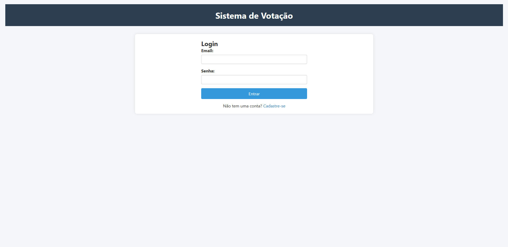
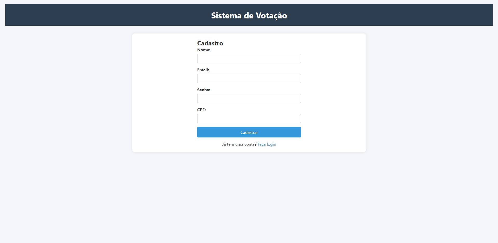
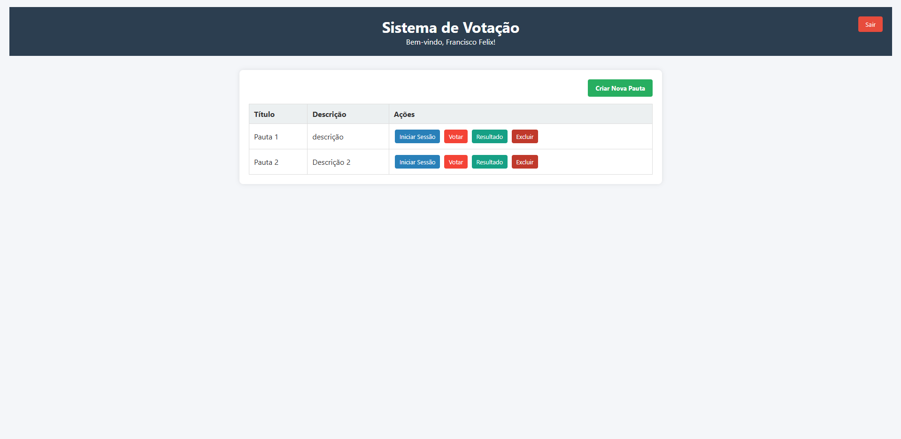

# 🗳️ Sistema de Votação - Desafio Técnico
Sistema de votação para cooperativas desenvolvido como parte de um desafio técnico, permitindo a criação de sessões de votação para pautas e registro de votos dos associados.

---

## ✨ Funcionalidades

- **Cadastro de Pautas** - Crie novas pautas para votação
- **Sessões de Votação** - Inicie sessões com tempo personalizável (padrão: 1 minuto)
- **Registro de Votos** - Associaços votam "Sim" ou "Não" nas pautas
- **Validações** - Impede votos duplicados e verifica CPF válido
- **Resultados em Tempo Real** - Acompanhe os resultados das votações
- **Interface Web** - Frontend intuitivo para interação com o sistema

---

## 🛠️ Tecnologias Utilizadas

### Backend
- **Java 17** - Linguagem de programação
- **Spring Boot** - Framework principal
- **Spring Data JPA** - Persistência de dados
- **MySQL** - Banco de dados relacional
- **Maven** - Gerenciamento de dependências
- **Lombok** - Redução de boilerplate code
- **SpringDoc OpenAPI** - Documentação da API

### Frontend
- **HTML5** - Estrutura da página
- **CSS3** - Estilização e layout
- **JavaScript** - Interatividade e consumo da API
- **Fetch API** - Comunicação com o backend

---

## ⚙️ Como Executar o Projeto

### 1️. Clonar o repositório
```bash
git clone https://github.com/JDeyvisson/Cripbet.git
```

### 2. Acessar a pasta do projeto
```bash
cd desafio-votacao
```

### 3. Configure o banco de dados
```bash
Edite o arquivo src/main/resources/application.properties com suas credenciais do MySQL.
```

### 4. Executar o projeto com Maven
```bash
mvn spring-boot:run
```

### 5. Acesse a aplicação
```bash
Frontend: http://localhost:8080/index.html
Swagger UI: http://localhost:8080/swagger-ui.html
```


---


## 🎯 Endpoints da API

### **Pauta Controller**

| Método | Endpoint | Descrição |
|:------:|-----------|-----------|
| **GET** | `/pautas` | Listar todas as pautas |
| **POST** | `/pautas` | Criar nova pauta |
| **DELETE** | `/pautas/{id}` | Excluir pasta |

### **Sessão de Votação Controller**

| Método | Endpoint | Descrição |
|:------:|-----------|-----------|
| **POST** | `/sessoes/{pautaId}	` | Abrir sessão de votação |

### **Voto Controller**

| Método | Endpoint | Descrição |
|:------:|-----------|-----------|
| **POST** | `/votos` | Registrar votos |
| **GET** | `/votos/resultado/{pautaId}	` | Consultar resultado da votação |
| **GET** | `/votes/pode-votar/{pautaId}	` | Verificar se o associado pode votar na pauta |

### **Associado Controller**

| Método | Endpoint | Descrição |
|:------:|-----------|-----------|
| **GET** | `/associados` | Listar todas os associados |
| **POST** | `/associados` | Cadastrar novo associado |
| **POST** | `/associados/login` | Realizar login do associado |

---

## 🎨 Interface do Sistema

### Telas Principais

#### Tela de Login

*Interface de autenticação para associados*

#### Tela de Cadastro

*Interface de cadastro para associados*

#### Tela de Menu

*Interface de menu*
